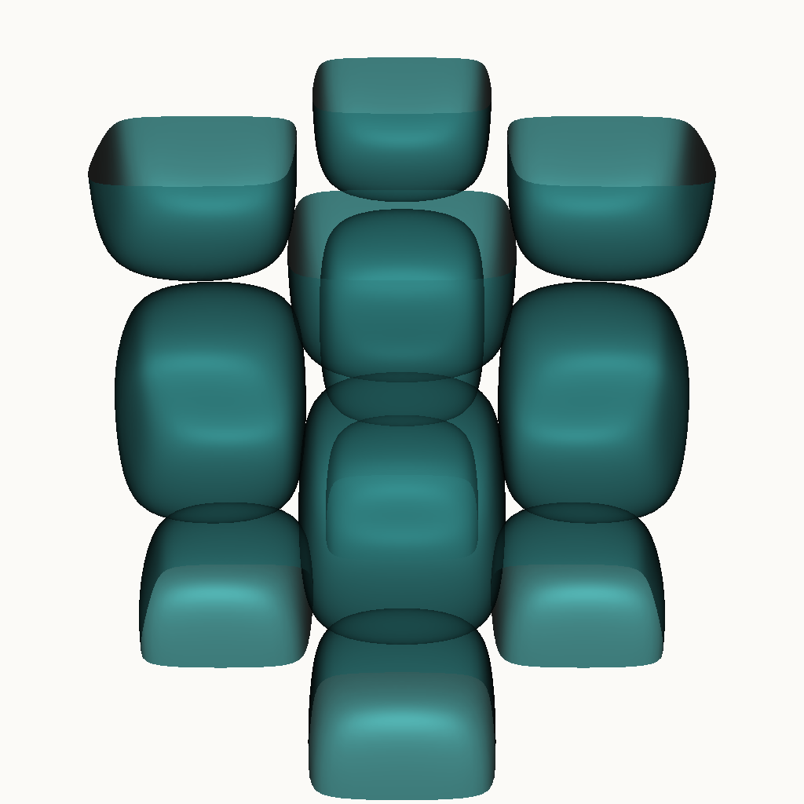

<div align="center">

# Scientific Visualization (ParaView) Portfolio

**by Katherine Feemster**

### Senior Scientific Visualization Specialist · ParaView · VTK · Catalyst In-Situ

[🌐 **Live portfolio site**](https://katherinejenniferhsfeemster.github.io/scientific-visualization-paraview-portfolio/) · [GitHub repo](https://github.com/katherinejenniferhsfeemster/scientific-visualization-paraview-portfolio)

     

*VTK-rendered Q-criterion, FEM stress fields, volumetric plumes, a ParaView plugin and a Catalyst in-situ pipeline — every figure regenerated headlessly from code.*

</div>

---

## Contents

- [Highlighted projects](#highlighted-projects)
- [Reproducibility](#reproducibility)
- [Tech stack](#tech-stack)
- [Editorial style](#editorial-style)
- [Repo layout](#repo-layout)
- [About the author](#about-the-author)
- [Contact](#contact)

---

## Hero



---

## Highlighted projects

| Project | Stack | What it proves |
| :-- | :-- | :-- |
| **[Turbulent flow visualization](projects/turbulent-flow-visualization/)** | Taylor-Green vortex | Analytic 3D vortex field, Q-criterion, RK4 streamlines, exported to `.vti`. |
| **[FEM stress field](projects/fem-stress-field/)** | Notched cantilever | 78k tetrahedra with σ + displacement, von Mises + warp-by-vector renders, `.vtu`. |
| **[Volumetric scalar field](projects/volumetric-scalar-field/)** | Atmospheric plume | 96³ procedural scalar, GPU volume render with hand-tuned transfer function. |
| **[ParaView custom plugin](projects/paraview-custom-plugin/)** | Server-manager proxy | XML proxy + Python module for vorticity magnitude + automatic seed extraction. |
| **[Catalyst in-situ pipeline](projects/catalyst-in-situ/)** | Catalyst v2 adaptor | Toy time-stepping driver that contours, colour-maps and screenshots in-process. |

---

## Reproducibility

```bash
pip install vtk numpy
python scripts/python/render_figures.py    # regenerates every PNG in docs/
```

Pure VTK in `scripts/python/` runs in CI without ParaView; `scripts/pvpython/` covers the pvbatch flows; the plugin and Catalyst adaptor have their own CMake builds.

---

## Tech stack

- **ParaView & VTK** — ParaView 5.13 pipelines, pvpython / pvbatch, ParaView server-manager plugin authoring (XML proxy + Python module).
- **In-situ** — Catalyst v2 adaptors, Conduit mesh descriptions, ADIOS2, timestep-driven screenshotting.
- **Formats** — `.vti` / `.vtu` / `.pvd` / `.vtk` / `.pvtu` / `.cgns` / Exodus-II.
- **Rendering** — Volume + iso + streamlines + warp-by-vector + glyphs · perceptual colour maps (viridis, cet_L17, cmocean).
- **Build & CI** — CMake 3.27, GitHub Actions — installs `vtk`, runs every script, publishes Pages.

---

## Editorial style

- **Palette** — teal `#2E7A7B` + amber `#D9A441` on ink `#0F1A1F` / paper `#FBFAF7`.
- **Type** — Inter (UI) + JetBrains Mono (code, netlists, timecode).
- **Determinism** — every generator is seeded; PNG, CSV and project-file bytes are stable across CI runs.
- **Licensing** — every tool in the pipeline is FOSS. No commercial SDK in the dependency tree.

---

## Repo layout

```
scientific-visualization-paraview-portfolio/
├── projects/                    # five case studies with their own READMEs
├── scripts/python/              # pure VTK — runs in CI, no ParaView needed
├── scripts/pvpython/            # pvpython / pvbatch flows
├── scripts/plugin/              # ParaView server-manager plugin (XML + Python)
├── scripts/catalyst/            # Catalyst v2 adaptor + driver
├── docs/                        # GitHub Pages site
└── .github/workflows/           # CI installs vtk, regenerates figures, deploys Pages
```

---

## About the author

Senior scientific-visualisation specialist building ParaView and VTK pipelines for research and HPC teams — Q-criterion, FEM post-processing, volume rendering, server-manager plugins and Catalyst in-situ adaptors. I care about reproducible artefacts (every PNG from code), perceptual colour mapping, and pipelines that survive a version bump.

Open to remote and contract engagements. This repository is the living portfolio companion to my CV.

---

## Contact

**Katherine Feemster**

- GitHub — [@katherinejenniferhsfeemster](https://github.com/katherinejenniferhsfeemster)
- Live site — [katherinejenniferhsfeemster.github.io/scientific-visualization-paraview-portfolio](https://katherinejenniferhsfeemster.github.io/scientific-visualization-paraview-portfolio/)
- Location — open to remote / contract

---

<div align="center">
<sub>Built diff-first, editor-second. Every figure on this page is produced by code in this repo.</sub>
</div>
